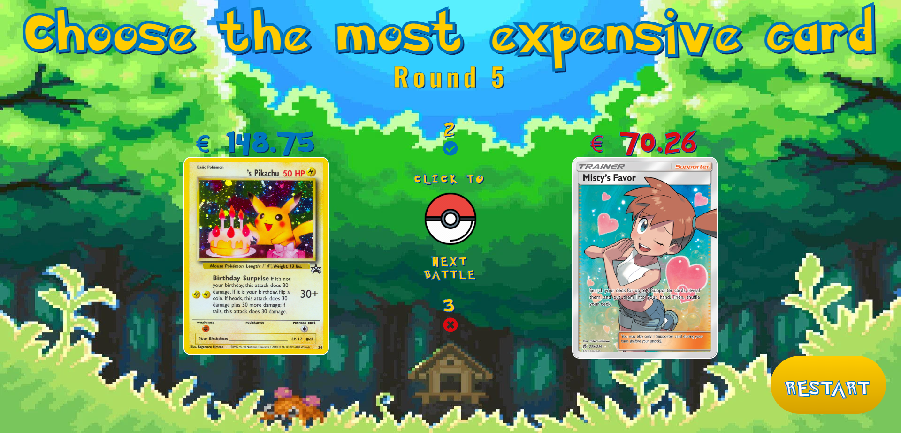

# PokePriceWars



> A guessing game based on the price of Pokémon TCG cards

### Live Demo

### 🛠 Tecnologias

As seguintes ferramentas foram usadas na construção do projeto:

- [Node.js](https://nodejs.org/en/)
- [React](https://pt-br.reactjs.org/)
- [TypeScript](https://www.typescriptlang.org/)

### 🎲 Running local

```bash
# Clone this repository
$ git clone <https://github.com/rodrigofmeneses/poke-price-wars>

# Change directory
$ cd poke-price-wars

# Install dependencies
$ npm install

# Run application
$ npm run dev

# The server will be start with vite
# Access <http://localhost:5173/>
```

### Pokemon TCG API

The prices are

If you want use the Pokemon tcg API key, just create a `.env` file with key `POKEMONTCG_API_KEY`. Like this:

```
POKEMONTCG_API_KEY=o123k1-sd50-41968-b446-lcosi5012
```

The public api has a limitation of 30 requests per minute.

### 🚀 Author

Made by Rodrigo Meneses

[](https://www.linkedin.com/in/rodrigofmeneses/)
[](https://twitter.com/rodrigofmeneses)
[](mailto:rodrigofmeneses97@gmail.com)
